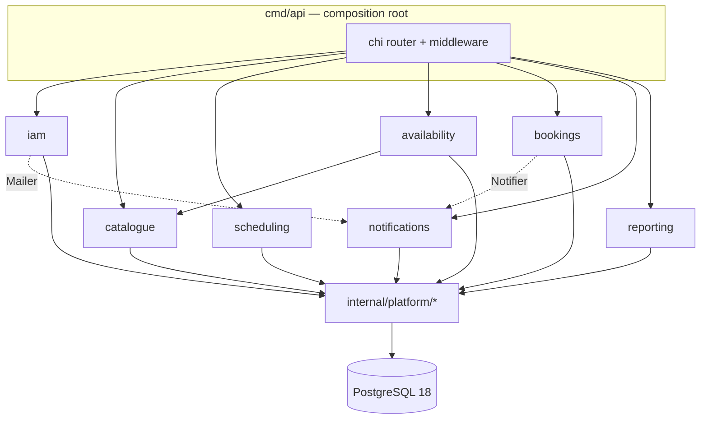
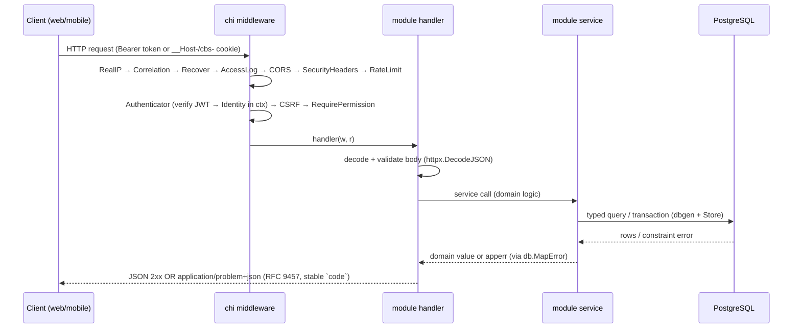
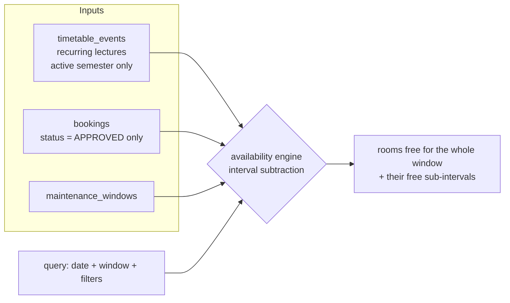
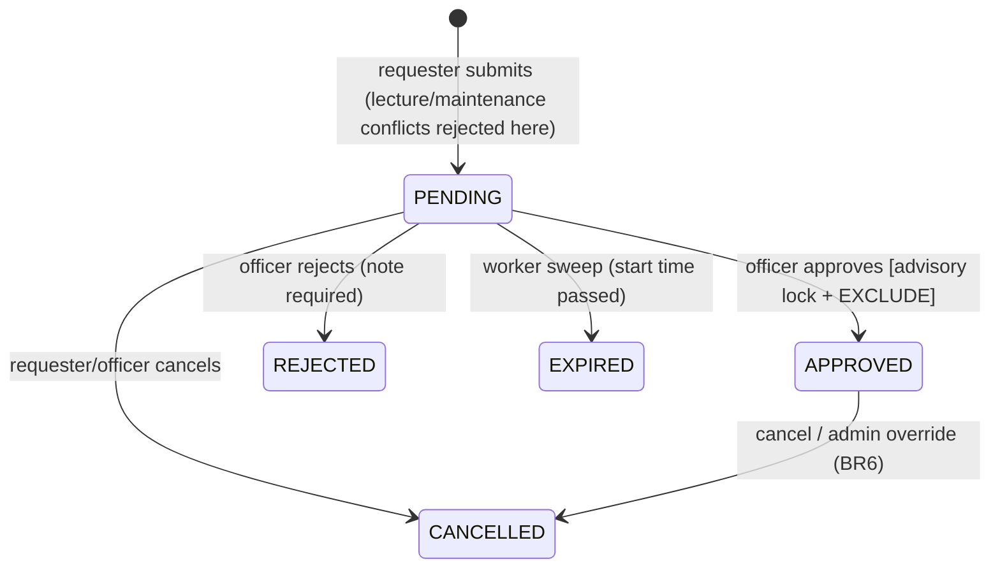

# Architecture

A guide to how **AURA — Ashesi University Resource Allocation** is structured: the
folder layout and *why* it's shaped that way, what every package/module contains,
how they depend on each other, and how a request and its data flow through the
system. (Identity & naming live in [BRAND.md](BRAND.md).)

Read this top-to-bottom and you should be able to find any piece of behaviour and
follow it from HTTP request → service → database → response.

---

## 1. What style is this? (flat? hexagonal?)

Neither flat nor strict hexagonal. It is a **modular monolith** with **layered,
bounded-context modules** over a shared **platform (infrastructure) layer**, and it
borrows the one genuinely useful idea from hexagonal/ports-and-adapters: **external
concerns sit behind interfaces** so they can be swapped.

Concretely:

- **One deployable API binary** (`cmd/api`) — not microservices. At this scale
  (one university, ~100 concurrent users) that's the right call; the module
  boundaries below are the *future* service seams.
- **Bounded-context modules** under `internal/`: `iam`, `catalogue`, `scheduling`,
  `availability`, `bookings`, `notifications`, `reporting`. Each module owns its
  domain and is internally **layered**:

  ```
  HTTP handler  →  service (domain logic)  →  data access (sqlc/pgx)  →  PostgreSQL
  (transport)      (business rules)           (typed queries)
  ```

- **Platform layer** (`internal/platform/`) is the "adapters" side: database pool,
  auth primitives, RBAC, HTTP plumbing, mailer, config, audit, metrics, logging.
  Modules depend on the platform; the platform never depends on a module.
- **Ports (interfaces) for swappable concerns**: `mailer.Mailer`, `auth.TokenSigner`,
  `bookings.Notifier`, `iam.Mailer`, `audit.Inserter`. Implementations are wired in
  `cmd/api` (composition root). This is what lets, e.g., the log-mailer become SMTP,
  or the in-process notifier become River, without touching domain code.

So: **module-per-bounded-context, layered inside, ports for the outside world.** Not
flat (logic isn't dumped in one package); not full hexagonal (we don't abstract the
database behind a repository interface — sqlc *is* the typed data layer, and the DB's
constraints are deliberately part of the domain guarantees).

The **web app** is a separate axis: a Next.js App Router application organised by
**route groups + feature folders**, consuming the API through a generated typed client.

---

## 2. Repository layout (monorepo)

Two toolchains in one repo: a **Go module** at the root (the backend) and a **pnpm +
Turborepo workspace** (web, mobile, shared TS packages).

```
/
├── cmd/                      Go entrypoints (the only `package main`s)
│   ├── api/                  HTTP API server (composition root: wires everything)
│   ├── worker/               background jobs (now folded into cmd/api; kept for a paid separate-worker deploy)
│   └── migrate/              goose migration runner (embeds db/migrations)
│
├── internal/                Go application code (not importable outside this module)
│   ├── iam/                  identity, auth, sessions, RBAC subjects, users, departments
│   ├── catalogue/            buildings, equipment, rooms, room-equipment, room search, image uploads
│   ├── scheduling/           semesters, lecture timetable events, CSV/XLSX ingestion
│   ├── availability/         read-only engine: derives free/occupied from the others
│   ├── bookings/             booking lifecycle, conflict detection, approval, maintenance
│   ├── notifications/        channel-agnostic dispatch (in-app + SSE + email + push)
│   ├── reporting/            utilisation / bookings / conflict aggregations + CSV
│   └── platform/             shared infrastructure (see §4)
│       ├── config/           env-driven configuration (12-factor)
│       ├── db/               pgx pool, tx helper, replica routing, error mapping, dbgen/
│       │   └── dbgen/        sqlc-GENERATED type-safe queries + models (do not edit)
│       ├── auth/             Argon2id, JWT signer, opaque tokens, AES-GCM, request identity
│       ├── rbac/             permission matrix (role → permissions)
│       ├── httpx/            problem+json, JSON helpers, pagination, middleware, cookies
│       ├── audit/            append-only audit-log recorder
│       ├── mailer/           Mailer interface + log/SMTP (Resend) implementations
│       ├── media/            Cloudinary image uploads (catalogue photos)
│       ├── metrics/          Prometheus domain metrics
│       ├── logging/          slog JSON logger + correlation id
│       └── pgconv/           conversions between Go time and pgtype values
│
├── db/
│   ├── migrations/           goose SQL migrations (forward-only) + embed.go
│   ├── queries/              sqlc source queries (*.sql) → generate dbgen/
│   └── seed/                 seed.sql (clean demo data; embedded into the API for SEED_DATA)
│
├── api/openapi.yaml          OpenAPI 3.1 contract (source of truth for clients)
│
├── apps/
│   ├── web/                  Next.js 16 app (public + requester portal + admin)
│   └── mobile/               Expo SDK 56 app (requester + booking officer; theming + reports)
│
├── packages/                 shared TS workspace packages
│   ├── api-client/           openapi-fetch client + generated schema.gen.ts
│   ├── schemas/              shared zod schemas + enums + error codes
│   ├── tokens/               framework-neutral brand palette + dark-tint catalogue (web + mobile)
│   ├── ui/                   Tailwind v4 tokens, shadcn-style components, datetime/cn helpers
│   └── config/               shared eslint / tsconfig
│
├── deploy/
│   ├── compose/              local docker-compose stack + Dockerfile.api
│   ├── render/               Dockerfile (one image: api+worker+migrate; Render deploys only the API)
│   ├── helm/                 Kubernetes chart (alternative to Render)
│   └── terraform/            IaC for the K8s target
│
├── docs/
│   ├── decisions/            ADRs (numbered; record non-obvious choices)
│   └── runbooks/             operational runbooks (incl. Render + K8s)
│
├── render.yaml               Render Blueprint (chosen deploy path)
├── go.mod / sqlc.yaml        Go module + sqlc config
└── pnpm-workspace.yaml / turbo.json   JS workspace
```

**The single most important design rule** (carried from the spec): *lecture
occupancy and booking occupancy are stored separately.* Lectures are recurring
`timetable_events` scoped to a semester; ad-hoc reservations are `bookings`.
Availability is **computed** from both (plus maintenance). Replacing a timetable
never touches bookings; clearing bookings never deletes lectures.

---

## 3. The Go modules (bounded contexts)

Every module follows the same internal shape. Taking `bookings` as the archetype:

| File | Layer | Responsibility |
|---|---|---|
| `handlers.go` | transport | parse/validate HTTP, RBAC per route, call service, render JSON/problem |
| `service.go` | domain | business rules, transactions, state machine, conflict logic |
| `state.go` | domain | the booking state-machine transition table |
| `dto.go` | transport | request/response shapes + mappers from DB rows to views |
| `maintenance.go` | domain | maintenance-window service (booking-adjacent occupancy) |
| `*_test.go` | — | unit (state machine) + integration (concurrency race, BR1–BR6) |

Module-by-module:

- **`iam`** — authentication and identity. Login (Argon2id verify, lockout, MFA),
  refresh-token rotation with reuse detection, password reset, TOTP MFA enrol/verify,
  and user/department management. Owns the `users`, `refresh_tokens`,
  `password_reset_tokens`, `departments` tables. Exposes `/api/v1/auth/*`,
  `/users`, `/departments`.

- **`catalogue`** — the physical estate: `buildings`, `equipment`, `rooms`,
  `room_equipment`. Also owns the **dynamic room search** (parameterised SQL with
  optional building/capacity/type/equipment filters) reused by the availability
  engine. Exposes `/buildings`, `/equipment`, `/rooms`.

- **`scheduling`** — `semesters` (with the single-ACTIVE-semester rule), lecture
  `timetable_events`, and **ingestion** (CSV/XLSX → validate each row → insert,
  collecting per-row errors). Exposes `/semesters`, `/timetable/*`.

- **`availability`** — a **read-only engine**, the technical core. `intervals.go` is
  pure interval arithmetic (merge/subtract/overlap on minutes-of-day, 100% tested);
  `engine.go` gathers occupancy (active-semester lectures + approved bookings +
  maintenance) and subtracts it from the requested window; `calendar.go` builds the
  unified day/week/month block view. Exposes `/availability/search`, `/calendar`.
  Depends on `catalogue` (for candidate rooms) and reads scheduling/booking/maintenance
  data via the shared store.

- **`bookings`** — the booking request lifecycle (state machine PENDING → APPROVED /
  REJECTED / CANCELLED / EXPIRED), submit-time conflict detection (reject if it
  overlaps a lecture or maintenance), and the **concurrency-safe approval** (per-room
  advisory lock + partial `EXCLUDE` constraint → exactly one winner). Also admin
  override (BR6) and maintenance windows. Exposes `/bookings/*`, `/maintenance-windows`.

- **`notifications`** — channel-agnostic dispatch. Persists in-app notifications
  (durable), pushes them live over **SSE** via an in-process `Broker`, and sends
  email + push off the request path. Implements `bookings.Notifier` and `iam.Mailer`.
  Exposes `/notifications/*`, `/devices`.

- **`reporting`** — utilisation (lecture vs booked hours, expanding recurring
  lectures across a date range), booking stats, and conflict counts, with CSV export.
  Exposes `/reports/*`.

### Module dependency graph



Cross-module coupling is deliberately tiny: `availability` reads catalogue rooms;
`bookings` and `iam` notify via the `Notifier`/`Mailer` *interfaces*. Everything else
goes through the shared platform store. No module imports another module's tables.

---

## 4. The platform layer (`internal/platform`)

Infrastructure shared by all modules. The key one is **`db`**:

- `db.Store` wraps the pgx pool and embeds the sqlc-generated `*dbgen.Queries`, so any
  module can run a typed query (`store.GetRoom(ctx, id)`).
- `Store.WithinTx` / `WithinTxDefault` run a closure in a transaction with a
  tx-bound `*dbgen.Queries` — used by the approval path and ingestion.
- `Store.Read` / `ReplicaPool` route read-only queries (availability, reporting) to a
  read replica when `DATABASE_REPLICA_URL` is set, else the primary.
- `MapError` translates Postgres errors (exclusion violations, the validation
  trigger's `RAISE`) into stable `apperr` codes — this is how the database's
  guarantees surface as clean API errors.

The rest:

| Package | Provides |
|---|---|
| `config` | typed env config (`config.Load()`), 12-factor; honours `$PORT` (Render) |
| `auth` | `HashPassword`/`VerifyPassword` (Argon2id), `TokenSigner` (JWT), opaque refresh tokens, `AESGCM`, request `Identity` in context |
| `rbac` | the §9.4 permission matrix; `Can(role, permission)`, deny-by-default |
| `httpx` | RFC 9457 problem+json, JSON decode/encode, cursor pagination, and middleware: recover, correlation-id, access log, **Authenticator**, **RequirePermission**, **CSRF**, **RateLimit**, **SecurityHeaders**, auth cookies |
| `apperr` | the catalogue of typed domain errors (status + stable `code` + fields) |
| `audit` | append-only audit-log recorder (every state change) |
| `mailer` | `Mailer` interface + log (dev) and SMTP implementations |
| `metrics` | Prometheus counters/histograms (bookings created/approved/…, search latency) |
| `logging` | slog JSON + correlation id helpers |
| `pgconv` | Go time ↔ pgtype conversions |

**Data access generation**: you write SQL in `db/queries/*.sql` with sqlc
annotations; `sqlc generate` (config in `sqlc.yaml`) reads the schema from
`db/migrations/` and emits type-safe Go into `internal/platform/db/dbgen/`. CI fails
if the committed generated code drifts. **Never hand-edit `dbgen/`.**

---

## 5. Request lifecycle (how to read a request)

Every authenticated API call flows through the same middleware chain, assembled in
`cmd/api/buildRouter`:



Auth specifics: web uses httpOnly cookies (`__Host-access`/`__Host-refresh` over
HTTPS; `cbs_access`/`cbs_refresh` over local HTTP) plus a double-submit
`X-CSRF-Token`; mobile uses `Authorization: Bearer`. RBAC is centralised — handlers
declare a permission via `httpx.RequirePermission(...)`; object-level ownership
(e.g. a requester reading only their own booking) is checked inside the handler.

---

## 6. The two occupancy datasets and how availability is derived

This is the heart of the domain. There is **no "is this room free" flag** anywhere —
availability is computed on demand.



- A room is **occupied** at instant *t* on date *D* iff an active-semester lecture for
  `weekday(D)` covers *t*, **or** an APPROVED booking on *D* covers *t*, **or** a
  maintenance window covers *t*.
- The engine clamps everything to local minutes-of-day and uses `availability/intervals.go`
  (`Subtract`, `Merge`, `Overlaps`) — half-open intervals, so a lecture ending at
  10:00 leaves the room free *from* 10:00.

---

## 7. The double-booking guarantee and the approval race

The database — not the application — is the source of truth for "is this slot taken":

- A **partial exclusion constraint** (`excl_booking_overlap`) makes two *APPROVED*
  bookings for the same room with overlapping time **impossible**. PENDING requests do
  not reserve (so many can compete for one slot).
- A **validation trigger** (`fn_validate_booking`) independently enforces not-in-past,
  single-day, capacity, and (when becoming APPROVED) lecture/maintenance precedence.
- On approval, `bookings.Service.Approve` takes a **per-room advisory lock**, flips the
  status inside a transaction, and lets the constraint settle the race; a violation is
  mapped to `409 SLOT_NO_LONGER_AVAILABLE`. The mandatory concurrency test proves:
  N officers approve competing requests → exactly one wins, the rest 409, DB ends with
  one approved row.



---

## 8. The web app (`apps/web`)

Next.js 16 App Router, organised by **route groups** (URL-invisible folders that share
a layout) and **feature folders**:

```
src/app/
├── (public)/          landing + room directory + privacy/terms (Ghana Act 843); SEO: sitemap/robots/manifest, OG + Twitter images, JSON-LD
├── (auth)/            login, forgot-password, reset-password
├── app/               REQUESTER portal  (gated): /app, /app/search, /app/bookings, /app/calendar, /app/notifications, /app/profile, /app/settings
├── admin/             ADMIN console     (gated): dashboard, approvals, rooms/buildings/equipment (search/filter + image uploads),
│                       semesters, timetable (alias-tolerant import + room provisioning), maintenance, users, departments, reports, audit, calendar
└── layout.tsx         root: no session read (public stays static for SEO) + a pre-paint theme bootstrap (mode + dark tint)
```

- `src/proxy.ts` (Next 16's renamed middleware) is the cheap first gate: it redirects
  `/app/*` and `/admin/*` to `/login` if the access cookie is absent, and stamps
  `X-Robots-Tag: noindex`. The **server layouts** (`app/layout.tsx`, `admin/layout.tsx`)
  do the authoritative session + role gate via `getSession()`.
- Data: Server Components fetch via the typed client; interactive bits are Client
  Components using `@tanstack/react-query`. Forms use `react-hook-form` + the shared
  zod schemas. The notifications bell subscribes to the SSE stream.
- The app talks to the API through `next.config.ts` rewrites (`/api/v1/* → API_ORIGIN`),
  so calls are same-origin (cookies + CSRF work without CORS) — the same proxy makes the
  Vercel→Render split possible.
- **Theming**: light/dark plus selectable dark "tints" — a `data-dark-tint` attribute drives
  CSS-variable overrides in `@cbs/ui`; a blocking inline script applies the saved mode + tint
  before first paint (no FOUC) and `ThemePreferenceSync` keeps it live. Account **Settings** is a
  tabbed surface (Profile / Security / Notifications / Preferences) carrying the tint picker.

### Shared TS packages

- **`@cbs/api-client`** — `createApi({ fetch })` (openapi-fetch) with CSRF middleware,
  `ApiError`/`unwrap` helpers, and `schema.gen.ts` generated from `api/openapi.yaml`.
- **`@cbs/schemas`** — zod schemas + enums + the stable error-code list, shared by web
  forms and (a copy in) mobile.
- **`@cbs/tokens`** — framework-neutral source of truth for the Ashesi brand palette and the
  dark-tint catalogue (value/label/swatches), consumed by both web (`@cbs/ui` + theme prefs)
  and mobile so the two stay in lockstep.
- **`@cbs/ui`** — Tailwind v4 `@theme` tokens (incl. the `.dark[data-dark-tint=…]` palettes),
  shadcn-style components, `cn` and institution-timezone datetime helpers (`Africa/Accra`).
- **`@cbs/config`** — shared eslint/tsconfig.

---

## 9. The mobile app (`apps/mobile`)

Expo SDK 56 + expo-router (file-based) + NativeWind. Screen groups mirror roles:
`(auth)/login`, `(requester)/` (search → results → request with an availability view,
bookings, `booking/[id]`, notifications, settings), `(officer)/` (approvals with blocker
panels, reports, notifications, settings). It uses Bearer tokens in `expo-secure-store`,
the same zod schemas (local copy), and registers an Expo push token via `POST /devices`.
Theming mirrors web — light/dark + the same dark tints from `@cbs/tokens`, persisted via
AsyncStorage and applied on launch, with the Outfit font. Local APK builds use an
`eas.json` profile (`pnpm apk` → `apps/mobile/build/aura.apk`). It type-checks + lints;
not yet run on a physical device.

---

## 10. Background work & deployment

- **Background jobs are folded into the API.** `cmd/api` runs the booking-expiry sweep
  (PENDING whose start has passed → EXPIRED) and idempotency-key cleanup on tickers in a
  goroutine (`runBackgroundJobs`), stopped on shutdown. `cmd/worker` still holds the same
  logic for a separate-worker / River deploy (ADR-0002), but the default single-service
  deploy needs no extra worker.
- **The API self-bootstraps on startup** so a shell-less, pre-deploy-less host just works:
  `AUTO_MIGRATE=true` applies the embedded goose migrations on boot (`runMigrations`), then
  `SEED_DATA=true` loads the embedded, idempotent `db/seed/seed.sql` (clean demo data) via the
  pgx simple-query protocol (`runSeed`). A `uuidv7()` polyfill (migration `00001`) keeps the
  schema portable to PG 16/17.
- **Deploy is split**: the **web** app → **Vercel** (root `apps/web`); the **Go API + Postgres**
  → **Render** (`render.yaml` Blueprint, one Docker image). The browser only talks to the Vercel
  origin; Next rewrites `/api/v1/*` to the API so cookies stay first-party. To keep costs low
  there is no separate worker and no Redis (rate-limit + SSE are in-process); managed Blueprint
  Postgres needs a paid plan (`basic-256mb`), with a free-Postgres-via-dashboard alternative
  documented in `render.yaml`. Mail is **Resend** (SMTP); catalogue images are **Cloudinary**.
  The Helm chart + Terraform under `deploy/` remain valid for a Kubernetes target. See
  `docs/DEPLOYMENT.md`.

---

## 11. How to navigate / extend, by task

| You want to… | Start here |
|---|---|
| Change an API behaviour | the module's `service.go` (logic) + `handlers.go` (HTTP) |
| Add an endpoint | `handlers.go` route + `service.go` method + a `db/queries/*.sql` → `sqlc generate` |
| Change the schema | new `db/migrations/NNN_*.sql` (forward-only) → `sqlc generate` |
| Understand availability | `internal/availability/intervals.go` then `engine.go` |
| Understand the booking guarantee | migration `00005` (constraints + trigger) + `bookings/service.go:Approve` |
| Change permissions | `internal/platform/rbac/rbac.go` |
| Change error codes/shape | `internal/platform/apperr` + `httpx/respond.go` |
| Add a web page | `apps/web/src/app/...` (pick the right route group) |
| Trace a request | `cmd/api/buildRouter` → middleware → module handler → service → `dbgen` query |
| See decisions/trade-offs | `docs/decisions/` (ADRs) |
```
