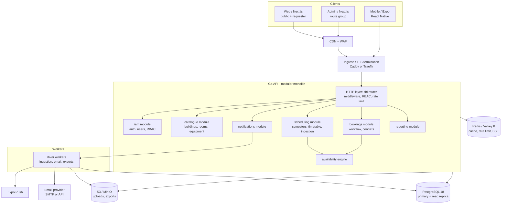
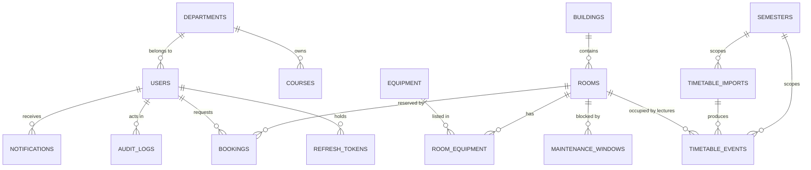
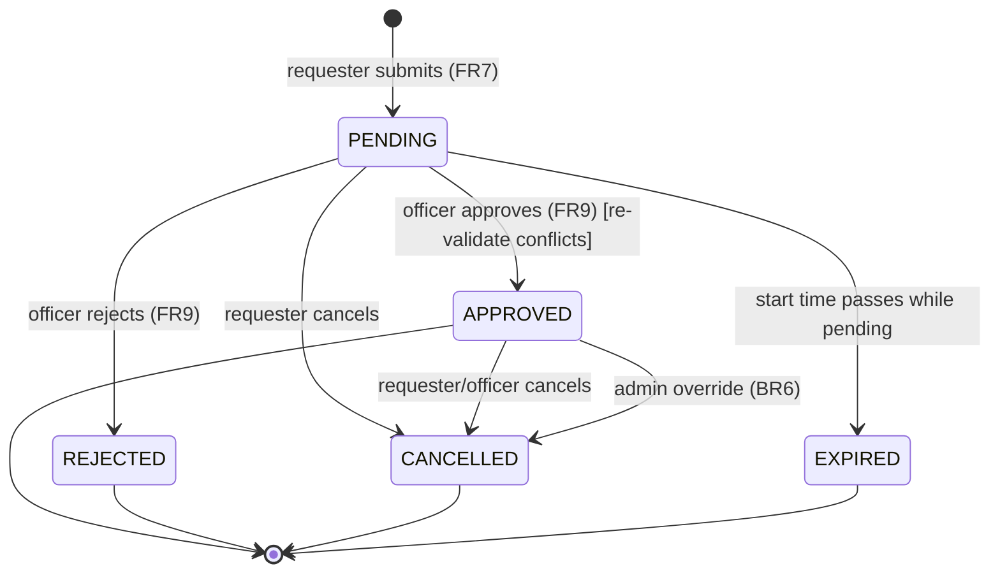

# Classroom Booking System — Technical Specification

**Document type:** Build specification for an autonomous implementation agent
**Status:** Authoritative. Build to this.
**Stack:** Go (backend) · React / Next.js (web + admin) · React Native / Expo (mobile) · PostgreSQL
**Spelling:** British English throughout.

---

## 0. Instructions to the implementing agent

Read this whole document before writing a line of code. It is the contract. Where it is silent, choose the most boring, most standard, most testable option and record the decision in `/docs/decisions/` as a short ADR.

### 0.1 Version policy

This document pins **floors**, not exact patches. Versions move. At build time, resolve the **latest stable patch** of each major line below and pin it in the lockfile. Never use beta, RC, canary, or pre-release in any branch that can reach `main`.

| Component | Major line to target (June 2026) | How to confirm latest |
|---|---|---|
| Go | 1.26.x | `go version`; https://go.dev/dl |
| Node.js | 24.x (Active LTS) | `node -v`; https://nodejs.org/en/about/previous-releases |
| PostgreSQL | 18.x | `SELECT version();` |
| Redis / Valkey | 8.x | `redis-server --version` |
| React | 19.2.x | `npm show react version` |
| Next.js | 16.x | `npm show next version` |
| React Native | 0.85+ (via Expo) | https://reactnative.dev/versions |
| Expo SDK | 56.x | `npx expo --version` |
| TypeScript | 6.x | `npm show typescript version` |
| Tailwind CSS | 4.x | `npm show tailwindcss version` |

Run the language- and ecosystem-specific "latest" check (`go get -u`, `pnpm up --latest` behind tests, `npx expo install --check`) and **gate every upgrade behind the full test suite**. Pin exact versions in `go.mod`, `pnpm-lock.yaml`, and `package.json` (no `^`/`~` ranges in committed manifests for production deps — use exact versions and let Renovate raise PRs).

### 0.2 Build order

1. Repository, tooling, CI skeleton, quality gates (Section 16, 17).
2. Database schema + migrations (Section 6).
3. Domain + service layer in Go, behind interfaces, with unit tests (Section 5, 7).
4. HTTP API per the OpenAPI contract (Section 8).
5. Auth + RBAC (Section 9).
6. Availability engine + conflict detection (Section 7) — this is the technical core; over-test it.
7. Timetable ingestion, bookings, approval workflow, notifications, reporting (Section 7).
8. Web app (public + requester + admin) (Section 10–12).
9. Mobile app (Section 13).
10. Observability, hardening, load testing, docs (Section 14, 15, 18).

### 0.3 Non-negotiable guardrails

- **No raw SQL string interpolation, ever.** Parameterised queries only (pgx / sqlc).
- **No secrets in code, config files, or images.** Environment + secret manager only.
- **No `any`/`interface{}` smuggling.** Explicit types. `golangci-lint` and `tsc --strict` must pass with zero warnings.
- **No new dependency** without a one-line justification in the PR and a clean `govulncheck` / `pnpm audit` / Trivy scan.
- **Double-booking is prevented in the database**, not just the application (Section 6.6). The application check is a UX courtesy; the constraint is the guarantee.
- **Every state-changing endpoint writes an audit log entry** (Section 6.9, NFR-SEC).
- **Definition of Done** (Section 19) applies to every unit of work.

---

## 1. Table of contents

1. Overview & objectives
2. Stakeholders & roles
3. Scope
4. Architecture
5. Domain model & ubiquitous language
6. Data model (DDL, constraints, indexes, migrations)
7. Core logic (availability, conflict detection, workflows, ingestion, notifications, reporting)
8. API specification
9. Authentication & authorisation
10. Web application (public + requester portal)
11. Admin application
12. SEO, accessibility & performance
13. Mobile application
14. Security
15. Observability & operations
16. Testing strategy
17. CI/CD & quality gates
18. Infrastructure & deployment
19. Configuration reference & Definition of Done
20. Functional requirement traceability
21. Roadmap (Phase 2+)
22. Appendix: package manifests

---

## 2. Overview & objectives

A centralised platform for managing classroom availability and bookings across a university. It ingests the per-semester lecture timetable, derives real-time room availability from that timetable plus ad-hoc reservations and maintenance windows, lets authorised users search and book rooms, runs a booking-approval workflow, and produces utilisation reporting.

**The central design decision** (carried directly from the source requirements' Developer's Note): *lecture occupancy and booking occupancy are stored separately*. Lectures are imported as recurring **timetable events** tied to a semester; ad-hoc reservations are stored as **bookings**. Availability is computed from both datasets (plus maintenance windows). Replacing a semester timetable never touches bookings, and clearing bookings never deletes lecture schedules.

**Objectives.** Store and manage classrooms; upload and maintain semester timetables; automatically determine availability; let users search; let authorised users reserve rooms; prevent conflicts with scheduled lectures; provide reporting and utilisation statistics.

**Platforms.** Three surfaces sharing one Go API:
- **Web (public + requester portal)** — Next.js, SSR/SSG for SEO on public pages, authenticated portal for searching and booking.
- **Admin** — management console (users, rooms, semesters, timetable, approvals, reports). Same Next.js app, gated route group.
- **Mobile** — React Native / Expo for requesters and booking officers (search, request, approve on the go, push notifications, QR check-in in Phase 2).

---

## 3. Stakeholders & roles

| Stakeholder | Concern | Maps to system role |
|---|---|---|
| University Administration | Oversight, configuration, reporting | `SYSTEM_ADMIN` |
| Academic Affairs Office | Timetable management | `TIMETABLE_ADMIN` |
| Department Administrators / Coordinators | Room booking | `REQUESTER` |
| Lecturers / Faculty / Faculty Interns | Room booking | `REQUESTER` |
| Student Organisation Representatives | Event room requests | `REQUESTER` |
| Booking Officers | Review/approve/reject requests, resolve conflicts | `BOOKING_OFFICER` |
| ICT Directorate | System maintenance, ops | `SYSTEM_ADMIN` (+ infra access) |

### 3.1 Role responsibilities

- **`SYSTEM_ADMIN`** — manage users; manage classrooms, buildings, equipment; upload/curate timetables; configure system settings; create/activate/archive semesters; generate all reports; override bookings (BR6); manage maintenance windows.
- **`TIMETABLE_ADMIN`** — upload semester schedules; modify lecture allocations; update classroom assignments within the active/draft semester. No user management, no booking approvals.
- **`BOOKING_OFFICER`** — review booking requests; approve/reject; resolve conflicts; view calendars and reports relevant to bookings. No user management, no timetable editing.
- **`REQUESTER`** — search availability; submit booking requests; view own booking status; cancel own pending/approved bookings.

Roles are exclusive at the row level but **permissions are additive by hierarchy** (`SYSTEM_ADMIN` ⊇ `BOOKING_OFFICER` ⊇ `REQUESTER`; `TIMETABLE_ADMIN` is orthogonal and also ⊇ `REQUESTER`). Enforced by a permission matrix (Section 9.4), not by role-name checks scattered in handlers.

---

## 4. Scope

### 4.1 In scope (MVP)
Classroom management · semester timetable management · room availability search · booking requests · booking approval workflow · conflict detection · notifications (email + in-app + mobile push) · reporting · audit logging · three client surfaces.

### 4.2 Out of scope (MVP)
Student attendance tracking · LMS functionality · examination management · payroll integration.

### 4.3 Phase 2 (Section 21)
University ERP integration · Microsoft Outlook / Microsoft 365 calendar sync · QR-code room check-in · AI-assisted room recommendations. (Mobile is delivered in MVP, not deferred.)

---

## 5. Architecture

### 5.1 Style

A **modular monolith** in Go for the MVP: one deployable API binary, internally partitioned into bounded modules with clean interfaces, so it can be split into services later without rewriting domain logic. At this scale (100+ concurrent users, single university), microservices are unjustified complexity. The module boundaries below are the future service seams.



### 5.2 Technology decisions (and why)

| Layer | Choice | Rationale |
|---|---|---|
| Language (API) | Go 1.26 | Performance, simple deploys (single binary), strong concurrency, `log/slog` built in. |
| HTTP router | `go-chi/chi/v5` | Idiomatic `net/http`, composable middleware, no framework lock-in. |
| DB access | `pgx/v5` + `sqlc` | Type-safe, compiled queries; no ORM magic; full control over SQL and Postgres features (ranges, exclusion constraints). |
| Migrations | `goose/v3` | Simple, forward-only, SQL-first; works as CLI and library. |
| Background jobs | `riverqueue/river` | Postgres-backed, transactional job enqueue (no extra broker); jobs commit atomically with the work that schedules them. |
| Cache / rate limit / pub-sub | Redis / Valkey 8 | Distributed rate limiting, hot caches, SSE fan-out. |
| Object storage | S3-compatible (AWS S3 / MinIO self-host) | Timetable uploads, report exports. |
| Web framework | Next.js 16 (App Router, React 19.2) | SSR/SSG/ISR for SEO; Server Components; Server Actions; Turbopack default. |
| Mobile | Expo SDK 56 (RN 0.85, React 19.2) | One codebase iOS/Android, EAS build/submit/OTA, file-based routing. |
| Styling | Tailwind CSS v4 (web) + NativeWind v4 (mobile) | Shared design tokens, utility-first, CSS-first config (`@theme`). |
| Typed API client | `openapi-typescript` + `openapi-fetch` | Web and mobile consume a client generated from the API's OpenAPI spec — no hand-written, drift-prone fetch code. |

### 5.3 Module boundaries (Go)

`iam` (identity, auth, RBAC, sessions) · `catalogue` (buildings, rooms, equipment) · `scheduling` (semesters, timetable events, ingestion) · `availability` (read-only engine over scheduling + bookings + maintenance) · `bookings` (requests, approval state machine, conflict detection) · `notifications` (channel-agnostic dispatch) · `reporting` (aggregations, exports). Cross-module calls go through exported service interfaces; no module reaches into another's tables directly.

### 5.4 Deployment topology

Stateless API replicas (≥2) behind ingress; a separate worker deployment running River; managed PostgreSQL 18 with a read replica for reporting/availability reads; managed Redis/Valkey; S3-compatible object store; CDN + WAF in front of static web assets and the public API edge. Full topology in Section 18.

---

## 6. Data model

PostgreSQL 18. UUIDv7 primary keys (time-ordered, index-friendly) via the built-in `uuidv7()`. All timestamps `timestamptz` stored in UTC; the application operates in a configured institution timezone (`APP_INSTITUTION_TZ`, default `Africa/Accra`). Money is not modelled (out of scope). Soft-delete via status enums, not row deletion, for auditable entities.

### 6.1 Extensions & custom types

```sql
CREATE EXTENSION IF NOT EXISTS btree_gist;   -- exclusion constraints mixing '=' and '&&'
CREATE EXTENSION IF NOT EXISTS pg_trgm;      -- fuzzy search on names/codes
CREATE EXTENSION IF NOT EXISTS citext;       -- case-insensitive email

-- A range type over time-of-day for recurring lecture overlap constraints.
CREATE TYPE timerange AS RANGE (subtype = time);

CREATE TYPE user_role        AS ENUM ('SYSTEM_ADMIN','TIMETABLE_ADMIN','BOOKING_OFFICER','REQUESTER');
CREATE TYPE user_status      AS ENUM ('ACTIVE','SUSPENDED','PENDING_VERIFICATION');
CREATE TYPE room_type        AS ENUM ('LECTURE_HALL','LAB','SEMINAR_ROOM','AUDITORIUM','CONFERENCE_ROOM');
CREATE TYPE room_status      AS ENUM ('ACTIVE','INACTIVE','UNDER_MAINTENANCE');
CREATE TYPE semester_status  AS ENUM ('DRAFT','ACTIVE','ARCHIVED');
CREATE TYPE day_of_week      AS ENUM ('MON','TUE','WED','THU','FRI','SAT','SUN');
CREATE TYPE booking_status   AS ENUM ('PENDING','APPROVED','REJECTED','CANCELLED','EXPIRED');
CREATE TYPE import_method    AS ENUM ('EXCEL','CSV','MANUAL');
CREATE TYPE import_status    AS ENUM ('PENDING','PROCESSING','COMPLETED','FAILED','PARTIALLY_COMPLETED');
CREATE TYPE notif_channel    AS ENUM ('EMAIL','IN_APP','PUSH');
```

### 6.2 Entity-relationship overview



### 6.3 Reference & identity tables

```sql
CREATE TABLE departments (
  id         uuid PRIMARY KEY DEFAULT uuidv7(),
  code       text NOT NULL UNIQUE,
  name       text NOT NULL,
  faculty    text,
  created_at timestamptz NOT NULL DEFAULT now(),
  updated_at timestamptz NOT NULL DEFAULT now()
);

CREATE TABLE users (
  id                    uuid PRIMARY KEY DEFAULT uuidv7(),
  email                 citext NOT NULL UNIQUE,
  password_hash         text NOT NULL,                 -- Argon2id encoded string
  full_name             text NOT NULL,
  role                  user_role NOT NULL DEFAULT 'REQUESTER',
  department_id         uuid REFERENCES departments(id) ON DELETE SET NULL,
  status                user_status NOT NULL DEFAULT 'PENDING_VERIFICATION',
  mfa_enabled           boolean NOT NULL DEFAULT false,
  mfa_secret_encrypted  bytea,                         -- AES-GCM, app-encrypted
  failed_login_attempts int NOT NULL DEFAULT 0,
  locked_until          timestamptz,
  last_login_at         timestamptz,
  created_at            timestamptz NOT NULL DEFAULT now(),
  updated_at            timestamptz NOT NULL DEFAULT now()
);
CREATE INDEX idx_users_role ON users(role);
CREATE INDEX idx_users_department ON users(department_id);

CREATE TABLE refresh_tokens (
  id         uuid PRIMARY KEY DEFAULT uuidv7(),
  user_id    uuid NOT NULL REFERENCES users(id) ON DELETE CASCADE,
  token_hash text NOT NULL UNIQUE,                     -- SHA-256 of opaque token; raw never stored
  user_agent text,
  ip_address inet,
  expires_at timestamptz NOT NULL,
  revoked_at timestamptz,
  created_at timestamptz NOT NULL DEFAULT now()
);
CREATE INDEX idx_refresh_user ON refresh_tokens(user_id) WHERE revoked_at IS NULL;

CREATE TABLE password_reset_tokens (
  id         uuid PRIMARY KEY DEFAULT uuidv7(),
  user_id    uuid NOT NULL REFERENCES users(id) ON DELETE CASCADE,
  token_hash text NOT NULL UNIQUE,
  expires_at timestamptz NOT NULL,
  used_at    timestamptz,
  created_at timestamptz NOT NULL DEFAULT now()
);
```

### 6.4 Catalogue tables

```sql
CREATE TABLE buildings (
  id         uuid PRIMARY KEY DEFAULT uuidv7(),
  code       text NOT NULL UNIQUE,
  name       text NOT NULL,
  campus     text,
  created_at timestamptz NOT NULL DEFAULT now(),
  updated_at timestamptz NOT NULL DEFAULT now()
);

CREATE TABLE equipment (
  id   uuid PRIMARY KEY DEFAULT uuidv7(),
  code text NOT NULL UNIQUE,   -- PROJECTOR, CAMERA, AUDIO_SYSTEM, SMART_BOARD, CONFERENCE_SETUP
  name text NOT NULL
);

CREATE TABLE rooms (
  id          uuid PRIMARY KEY DEFAULT uuidv7(),
  room_code   text NOT NULL UNIQUE,
  name        text NOT NULL,
  building_id uuid NOT NULL REFERENCES buildings(id) ON DELETE RESTRICT,
  capacity    int  NOT NULL CHECK (capacity > 0),
  room_type   room_type NOT NULL,
  status      room_status NOT NULL DEFAULT 'ACTIVE',
  created_at  timestamptz NOT NULL DEFAULT now(),
  updated_at  timestamptz NOT NULL DEFAULT now()
);
CREATE INDEX idx_rooms_building ON rooms(building_id);
CREATE INDEX idx_rooms_capacity ON rooms(capacity);
CREATE INDEX idx_rooms_type     ON rooms(room_type);
CREATE INDEX idx_rooms_status    ON rooms(status);
CREATE INDEX idx_rooms_name_trgm ON rooms USING gin (name gin_trgm_ops);

CREATE TABLE room_equipment (
  room_id      uuid NOT NULL REFERENCES rooms(id) ON DELETE CASCADE,
  equipment_id uuid NOT NULL REFERENCES equipment(id) ON DELETE CASCADE,
  quantity     int  NOT NULL DEFAULT 1 CHECK (quantity > 0),
  PRIMARY KEY (room_id, equipment_id)
);
```

### 6.5 Scheduling tables (lecture occupancy — recurring)

```sql
CREATE TABLE semesters (
  id         uuid PRIMARY KEY DEFAULT uuidv7(),
  name       text NOT NULL,
  start_date date NOT NULL,
  end_date   date NOT NULL,
  status     semester_status NOT NULL DEFAULT 'DRAFT',
  created_at timestamptz NOT NULL DEFAULT now(),
  updated_at timestamptz NOT NULL DEFAULT now(),
  CHECK (end_date > start_date)
);
-- At most one ACTIVE semester (BR2). Partial unique index on an immutable constant.
CREATE UNIQUE INDEX uq_one_active_semester ON semesters ((true)) WHERE status = 'ACTIVE';

CREATE TABLE courses (
  id            uuid PRIMARY KEY DEFAULT uuidv7(),
  course_code   text NOT NULL UNIQUE,
  title         text NOT NULL,
  department_id uuid REFERENCES departments(id) ON DELETE SET NULL,
  created_at    timestamptz NOT NULL DEFAULT now()
);

CREATE TABLE timetable_imports (
  id              uuid PRIMARY KEY DEFAULT uuidv7(),
  semester_id     uuid NOT NULL REFERENCES semesters(id) ON DELETE CASCADE,
  uploaded_by     uuid NOT NULL REFERENCES users(id) ON DELETE RESTRICT,
  method          import_method NOT NULL,
  file_object_key text,                       -- S3 key of the original upload
  status          import_status NOT NULL DEFAULT 'PENDING',
  total_rows      int NOT NULL DEFAULT 0,
  imported_rows   int NOT NULL DEFAULT 0,
  error_rows      int NOT NULL DEFAULT 0,
  error_report    jsonb,                       -- [{row, field, message}]
  created_at      timestamptz NOT NULL DEFAULT now(),
  completed_at    timestamptz
);
CREATE INDEX idx_tt_imports_semester ON timetable_imports(semester_id);

CREATE TABLE timetable_events (
  id            uuid PRIMARY KEY DEFAULT uuidv7(),
  semester_id   uuid NOT NULL REFERENCES semesters(id) ON DELETE CASCADE,
  import_id     uuid REFERENCES timetable_imports(id) ON DELETE SET NULL,
  room_id       uuid NOT NULL REFERENCES rooms(id) ON DELETE RESTRICT,
  course_code   text NOT NULL,
  course_title  text NOT NULL,
  lecturer_name text NOT NULL,
  day           day_of_week NOT NULL,
  start_time    time NOT NULL,
  end_time      time NOT NULL,
  created_at    timestamptz NOT NULL DEFAULT now(),
  CHECK (end_time > start_time)
);
CREATE INDEX idx_tt_events_room_day  ON timetable_events(room_id, day);
CREATE INDEX idx_tt_events_semester  ON timetable_events(semester_id);

-- No two lectures may overlap in the same room/day within one semester.
ALTER TABLE timetable_events
  ADD CONSTRAINT excl_tt_overlap
  EXCLUDE USING gist (
    room_id     WITH =,
    semester_id WITH =,
    day         WITH =,
    timerange(start_time, end_time, '[)') WITH &&
  );
```

### 6.6 Booking & maintenance tables (ad-hoc occupancy — concrete) — **double-booking guarantee**

```sql
CREATE TABLE bookings (
  id             uuid PRIMARY KEY DEFAULT uuidv7(),
  room_id        uuid NOT NULL REFERENCES rooms(id) ON DELETE RESTRICT,
  requested_by   uuid NOT NULL REFERENCES users(id) ON DELETE RESTRICT,
  purpose        text NOT NULL,
  attendee_count int  NOT NULL CHECK (attendee_count > 0),
  starts_at      timestamptz NOT NULL,
  ends_at        timestamptz NOT NULL,
  status         booking_status NOT NULL DEFAULT 'PENDING',
  reviewed_by    uuid REFERENCES users(id) ON DELETE SET NULL,
  review_note    text,
  reviewed_at    timestamptz,
  cancelled_at   timestamptz,
  during         tstzrange GENERATED ALWAYS AS (tstzrange(starts_at, ends_at, '[)')) STORED,
  created_at     timestamptz NOT NULL DEFAULT now(),
  updated_at     timestamptz NOT NULL DEFAULT now(),
  CHECK (ends_at > starts_at)
);
CREATE INDEX idx_bookings_room      ON bookings(room_id);
CREATE INDEX idx_bookings_requester ON bookings(requested_by);
CREATE INDEX idx_bookings_status    ON bookings(status);
CREATE INDEX idx_bookings_during    ON bookings USING gist (during);

-- THE GUARANTEE: two APPROVED bookings for the same room cannot overlap.
-- Partial constraint => PENDING requests do NOT reserve the room (BR5),
-- so multiple pending requests may compete for the same slot and are
-- resolved deterministically at approval time.
ALTER TABLE bookings
  ADD CONSTRAINT excl_booking_overlap
  EXCLUDE USING gist (room_id WITH =, during WITH &&)
  WHERE (status = 'APPROVED');

CREATE TABLE maintenance_windows (
  id         uuid PRIMARY KEY DEFAULT uuidv7(),
  room_id    uuid NOT NULL REFERENCES rooms(id) ON DELETE CASCADE,
  starts_at  timestamptz NOT NULL,
  ends_at    timestamptz NOT NULL,
  reason     text NOT NULL,
  created_by uuid NOT NULL REFERENCES users(id) ON DELETE RESTRICT,
  during     tstzrange GENERATED ALWAYS AS (tstzrange(starts_at, ends_at, '[)')) STORED,
  created_at timestamptz NOT NULL DEFAULT now(),
  CHECK (ends_at > starts_at)
);
CREATE INDEX idx_maint_room   ON maintenance_windows(room_id);
CREATE INDEX idx_maint_during ON maintenance_windows USING gist (during);
ALTER TABLE maintenance_windows
  ADD CONSTRAINT excl_maint_overlap
  EXCLUDE USING gist (room_id WITH =, during WITH &&);
```

### 6.7 Booking validation trigger (defence-in-depth)

The service layer is the primary place conflict logic runs (Section 7.3), but a trigger enforces the invariants regardless of how a row is written. Bookings are constrained to a **single institution-local calendar day** so weekday derivation for the recurring-lecture check is unambiguous.

```sql
CREATE OR REPLACE FUNCTION fn_validate_booking() RETURNS trigger AS $$
DECLARE
  v_tz        text := coalesce(current_setting('app.institution_tz', true), 'Africa/Accra');
  v_cap       int;
  v_dow       int;     -- 0=Sun .. 6=Sat
  v_day       day_of_week;
  v_local_d   date;
  v_local_s   time;
  v_local_e   time;
  v_hits      int;
BEGIN
  -- BR3: not in the past
  IF NEW.starts_at < now() THEN
    RAISE EXCEPTION 'BOOKING_IN_PAST';
  END IF;

  -- Single local day
  IF (NEW.starts_at AT TIME ZONE v_tz)::date <> (NEW.ends_at AT TIME ZONE v_tz)::date THEN
    RAISE EXCEPTION 'BOOKING_SPANS_MULTIPLE_DAYS';
  END IF;

  -- BR4: capacity
  SELECT capacity INTO v_cap FROM rooms WHERE id = NEW.room_id;
  IF NEW.attendee_count > v_cap THEN
    RAISE EXCEPTION 'ATTENDEES_EXCEED_CAPACITY';
  END IF;

  -- Hard conflicts only matter when the row is (becoming) APPROVED.
  IF NEW.status = 'APPROVED' THEN
    v_local_d := (NEW.starts_at AT TIME ZONE v_tz)::date;
    v_local_s := (NEW.starts_at AT TIME ZONE v_tz)::time;
    v_local_e := (NEW.ends_at   AT TIME ZONE v_tz)::time;
    v_dow := extract(dow from v_local_d);
    v_day := (ARRAY['SUN','MON','TUE','WED','THU','FRI','SAT'])[v_dow + 1]::day_of_week;

    -- BR1: lecture precedence (active semester, matching weekday, overlapping time)
    SELECT count(*) INTO v_hits
    FROM timetable_events te
    JOIN semesters s ON s.id = te.semester_id AND s.status = 'ACTIVE'
    WHERE te.room_id = NEW.room_id
      AND te.day = v_day
      AND v_local_d BETWEEN s.start_date AND s.end_date
      AND timerange(te.start_time, te.end_time, '[)') && timerange(v_local_s, v_local_e, '[)');
    IF v_hits > 0 THEN
      RAISE EXCEPTION 'CONFLICTS_WITH_LECTURE';
    END IF;

    -- Maintenance overlap
    SELECT count(*) INTO v_hits
    FROM maintenance_windows mw
    WHERE mw.room_id = NEW.room_id AND mw.during && NEW.during;
    IF v_hits > 0 THEN
      RAISE EXCEPTION 'CONFLICTS_WITH_MAINTENANCE';
    END IF;
  END IF;

  RETURN NEW;
END;
$$ LANGUAGE plpgsql;

CREATE TRIGGER trg_validate_booking
  BEFORE INSERT OR UPDATE ON bookings
  FOR EACH ROW EXECUTE FUNCTION fn_validate_booking();
```

`app.institution_tz` is set per connection by the application (`SET app.institution_tz = 'Africa/Accra'`) or via the database's parameter defaults.

### 6.8 Notifications

```sql
CREATE TABLE notifications (
  id                  uuid PRIMARY KEY DEFAULT uuidv7(),
  user_id             uuid NOT NULL REFERENCES users(id) ON DELETE CASCADE,
  channel             notif_channel NOT NULL,
  type                text NOT NULL,   -- BOOKING_SUBMITTED|APPROVED|REJECTED|CANCELLED|REMINDER
  title               text NOT NULL,
  body                text NOT NULL,
  related_entity_type text,
  related_entity_id   uuid,
  read_at             timestamptz,
  sent_at             timestamptz,
  created_at          timestamptz NOT NULL DEFAULT now()
);
CREATE INDEX idx_notif_user_unread ON notifications(user_id, created_at DESC) WHERE read_at IS NULL;
```

### 6.9 Audit log (append-only)

```sql
CREATE TABLE audit_logs (
  id          uuid PRIMARY KEY DEFAULT uuidv7(),
  actor_id    uuid REFERENCES users(id) ON DELETE SET NULL,
  action      text NOT NULL,   -- CREATE|UPDATE|DELETE|APPROVE|REJECT|OVERRIDE|LOGIN|LOGIN_FAILED|...
  entity_type text NOT NULL,
  entity_id   uuid,
  changes     jsonb,           -- {"before":{...},"after":{...}}
  ip_address  inet,
  user_agent  text,
  created_at  timestamptz NOT NULL DEFAULT now()
);
CREATE INDEX idx_audit_entity  ON audit_logs(entity_type, entity_id);
CREATE INDEX idx_audit_actor   ON audit_logs(actor_id);
CREATE INDEX idx_audit_created ON audit_logs(created_at);
```

Grant the application role `INSERT, SELECT` only on `audit_logs` (no `UPDATE`/`DELETE`). Append-only is enforced by privilege, not convention.

### 6.10 Migrations

`goose` SQL migrations in `/db/migrations`, numbered and timestamped, **forward-only**. Schema changes follow **expand → migrate → contract**: add new structures, deploy code that writes both old and new, backfill, switch reads, then drop old in a later release. Never a destructive change in the same deploy as the code that depends on it. Every migration has an `-- +goose Up` and `-- +goose Down`; Down is for local/staging only — production rolls forward.

`sqlc.yaml` generates type-safe Go from `/db/queries/*.sql` against the live schema; CI regenerates and fails if the committed generated code is stale.

---

## 7. Core logic

### 7.1 Availability engine

Given a query — date `D`, window `[T1, T2]` (institution-local), and static filters (building, minimum capacity, room type, required equipment) — return rooms free for the **entire** window, with their free sub-intervals.

**Algorithm**

```
function searchAvailability(D, T1, T2, filters):
  candidates = rooms WHERE status='ACTIVE'
                     AND building matches filter
                     AND capacity >= filter.minCapacity
                     AND room_type matches filter
                     AND room has ALL required equipment
  results = []
  for room in candidates:
      occupied = []
      // Lecture occupancy (active semester only — BR2)
      if activeSemester covers D:
        for ev in timetableEvents(room, weekday(D), activeSemester):
            occupied += [ev.start_time, ev.end_time]
      // Booking occupancy (APPROVED only — BR5)
      for b in approvedBookings(room, on=D):
            occupied += localTimes(b)
      // Maintenance
      for m in maintenanceOverlapping(room, D):
            occupied += clampToDay(m, D)
      free = subtractIntervals([T1, T2], merge(occupied))
      if free covers [T1, T2] fully:
            results += { room, capacity, freeIntervals: free }
  return results
```

The merge/subtract is interval arithmetic on `time`. Implement and unit-test as a pure Go function (`internal/availability/intervals.go`) with table-driven tests covering: no occupancy, full occupancy, partial overlaps at both edges, adjacency (touching but not overlapping must remain free), and identical boundaries.

**Performance.** This runs against the read replica. For the common "calendar grid for a building/day" query, a single SQL pass per dataset feeds the in-memory merge; cache per `(building_id, date)` in Redis with a short TTL, invalidated on any booking approval/cancellation or timetable change touching that building/day. NFR target: search returns within **3 s** (Section 7 of source). Realistic budget is < 300 ms server-side at the stated scale.

### 7.2 Booking state machine



Transitions are validated in the service layer; illegal transitions return `409 Conflict`. `EXPIRED` is set by a scheduled River job that sweeps stale `PENDING` rows whose `starts_at < now()`.

### 7.3 Conflict detection & the approval race

At **submission** (PENDING): validate not-in-past (BR3), capacity (BR4), single-day; check overlaps against lectures and maintenance and **reject submission** if they exist (no point queuing a request that can never be approved because a lecture owns the slot — BR1). Overlap with other *pending* requests is allowed (they don't reserve — BR5) but surfaced to the requester (FR8: "immediately notify users of conflicts").

At **approval**: the dangerous moment is two officers approving two pending requests for the same room/slot concurrently. Handle it with **both** layers:

1. The partial `EXCLUDE` constraint (Section 6.6) makes overlapping approved bookings *impossible* — the second `UPDATE ... SET status='APPROVED'` fails with a unique/exclusion violation, which the service maps to `409 SLOT_NO_LONGER_AVAILABLE`.
2. Wrap the approval in a transaction at `SERIALIZABLE` isolation (or take a per-room advisory lock `pg_advisory_xact_lock(hashtext(room_id::text))`) so the lecture/maintenance re-check and the status flip are atomic.

This means: pending requests never block availability; approval is first-come-first-served and atomic; the database is the source of truth for "is this slot taken".

**Admin override (BR6).** `SYSTEM_ADMIN` may force a booking through, optionally cancelling conflicting approved bookings in the same transaction (notifying affected requesters). Every override writes an audit entry with before/after.

### 7.4 Approval sequence

```mermaid
sequenceDiagram
  participant R as Requester
  participant API
  participant DB as PostgreSQL
  participant Q as River (jobs)
  participant N as Notifications

  R->>API: POST /bookings (room, date, time, purpose, attendees)
  API->>DB: validate (past? capacity? single-day? lecture/maint overlap?)
  alt blocked by lecture/maintenance
    API-->>R: 422 with conflict detail
  else ok
    API->>DB: INSERT booking PENDING
    API->>Q: enqueue notify(officers, BOOKING_SUBMITTED)
    API-->>R: 201 Created
    Q->>N: dispatch email + in-app + push
  end

  Note over API,DB: later — officer reviews
  API->>DB: BEGIN SERIALIZABLE; re-check; UPDATE status=APPROVED
  alt exclusion violation
    DB-->>API: conflict
    API-->>API: map to 409 SLOT_NO_LONGER_AVAILABLE
  else committed
    API->>Q: enqueue notify(requester, BOOKING_APPROVED)
    API->>DB: invalidate availability cache (building, date)
  end
```

### 7.5 Timetable ingestion (FR4)

Accept **Excel (.xlsx)**, **CSV**, and **manual entry**. Columns: Course Code, Course Title, Lecturer, Room, Day, Start Time, End Time.

Flow: upload → store original to S3 → create `timetable_imports` row (`PENDING`) → enqueue a River ingestion job → respond `202 Accepted` with the import id. The worker:

1. Parses with `excelize/v2` (xlsx) or `encoding/csv` (CSV).
2. Validates each row: room exists (by `room_code`), day ∈ enum, times parseable and `end > start`, no duplicate within the upload, no overlap with already-imported events for the same room/day/semester (the `excl_tt_overlap` constraint backs this).
3. Inserts valid rows in batches inside a transaction; collects per-row errors into `error_report` (jsonb).
4. Sets status `COMPLETED` / `PARTIALLY_COMPLETED` / `FAILED` and `imported_rows`/`error_rows`.

Replacing a semester's timetable replaces only `timetable_events` for that semester — bookings are untouched (the core design rule). Provide a "replace" mode (delete existing events for the semester, then import) and an "append" mode.

Time parsing must accept common spreadsheet formats (`08:00`, `8:00 AM`, `0800`) and normalise to 24-hour `time`. Reject ambiguous values rather than guessing.

### 7.6 Automatic room occupancy (FR5)

There is no separate "occupied" flag to maintain — occupancy is *derived*. A room is occupied at instant `t` on date `D` iff an active-semester lecture for `weekday(D)` covers `t`, or an approved booking on `D` covers `t`, or a maintenance window covers `t`. The example in the source (A101 Monday 08:00–10:00 occupied; free before/after) is exactly the interval subtraction in 7.1.

### 7.7 Calendar view (FR10)

`GET /api/v1/calendar?view=day|week|month&date=&room_id=&building_id=` returns a unified set of blocks tagged by source: `LECTURE`, `BOOKING` (with status), `MAINTENANCE`, and computed `AVAILABLE` gaps. The client renders day/week/month. Lectures are expanded from recurrence across the requested range (respecting semester bounds). Bookings and maintenance are concrete. Colour-code by source.

### 7.8 Notifications (FR11)

Channel-agnostic dispatch. Events: `BOOKING_SUBMITTED` (→ booking officers), `BOOKING_APPROVED`, `BOOKING_REJECTED`, `BOOKING_CANCELLED` (→ requester), plus reminders. Each event fans out to the channels the recipient is enrolled in: **email** (always), **in-app** (persisted in `notifications`, delivered live via SSE/Redis pub-sub), **push** (mobile, via Expo Push). Dispatch runs in River jobs so a slow email provider never blocks the request path. Email templates are versioned (Go `html/template`, or MJML compiled to HTML at build time) and localisable.

### 7.9 Reporting (FR12)

Three reports, each filterable by date range, building, department, room:

- **Room utilisation** — hours occupied (lectures), hours booked (approved bookings), hours available, utilisation %, per room and aggregated.
- **Booking report** — number of bookings, by department, by building, approval/rejection rates.
- **Conflict report** — rejected requests, attempted conflicts, lecture-vs-request clashes.

Small reports render synchronously as JSON for on-screen tables/charts. Large exports (`format=csv|xlsx|pdf`) are generated by a River job that writes to S3 and notifies the user with a signed download URL. xlsx via `excelize/v2`; PDF via a headless renderer (e.g. server-side HTML→PDF) — keep PDF generation in the worker, never in the request path.

---

## 8. API specification

REST, JSON, versioned under `/api/v1`. Contract-first: maintain `/api/openapi.yaml` (OpenAPI 3.1) as the source of truth; generate the typed web/mobile client and (optionally) Go server stubs via `oapi-codegen` from it. CI fails if handlers and spec drift.

### 8.1 Conventions

- **Auth:** `Authorization: Bearer <access_jwt>` for API clients; web uses httpOnly secure cookies (Section 9.2).
- **Content type:** `application/json`; errors as `application/problem+json` (RFC 9457).
- **Pagination:** cursor-based — `?limit=50&cursor=<opaque>`; response `{ "data": [...], "next_cursor": "..." | null }`.
- **Sorting:** `?sort=field:asc,other:desc` (allow-listed fields per endpoint).
- **Filtering:** explicit query params per endpoint (documented), never arbitrary SQL.
- **Idempotency:** mutating creates (notably `POST /bookings`) accept `Idempotency-Key`; the server stores the key→result for 24 h and replays the response on retry.
- **Rate limits:** per-user and per-IP; responses carry `RateLimit-Limit`, `RateLimit-Remaining`, `RateLimit-Reset` (IETF draft headers); `429` on exceed.
- **Timestamps:** RFC 3339 UTC in payloads; the client renders in institution TZ.

### 8.2 Error model (RFC 9457)

```json
{
  "type": "https://api.cbs.example.edu/errors/slot-unavailable",
  "title": "Slot no longer available",
  "status": 409,
  "detail": "Room A101 was approved for another booking at 14:00–16:00.",
  "instance": "/api/v1/bookings/018f.../approve",
  "code": "SLOT_NO_LONGER_AVAILABLE",
  "errors": [
    { "field": "attendee_count", "message": "exceeds room capacity of 40" }
  ]
}
```

`code` is a stable machine string clients switch on. `errors[]` carries field-level validation failures (`400`/`422`).

### 8.3 Endpoint catalogue

Roles shown are the **minimum** required; higher roles inherit.

#### Auth & account
| Method | Path | Role | Purpose |
|---|---|---|---|
| POST | `/api/v1/auth/login` | public | Email + password (+ MFA code if enabled) → tokens / cookies. |
| POST | `/api/v1/auth/refresh` | public | Rotate refresh token → new access token. |
| POST | `/api/v1/auth/logout` | auth | Revoke refresh token / clear cookies. |
| GET  | `/api/v1/auth/me` | auth | Current user + permissions. |
| POST | `/api/v1/auth/password/forgot` | public | Issue reset token (always 200; no user enumeration). |
| POST | `/api/v1/auth/password/reset` | public | Reset with token. |
| POST | `/api/v1/auth/mfa/enrol` | auth | Begin TOTP enrolment (returns provisioning URI). |
| POST | `/api/v1/auth/mfa/verify` | auth | Confirm TOTP and enable MFA. |

#### Users & org (SYSTEM_ADMIN)
| Method | Path | Purpose |
|---|---|---|
| GET / POST | `/api/v1/users` | List (filter by role/department/status) / create. |
| GET / PATCH | `/api/v1/users/{id}` | Read / update. |
| PATCH | `/api/v1/users/{id}/role` | Change role. |
| POST | `/api/v1/users/{id}/suspend` · `/reactivate` | Lifecycle. |
| CRUD | `/api/v1/departments` | Departments. |

#### Catalogue
| Method | Path | Role | Purpose |
|---|---|---|---|
| GET | `/api/v1/buildings` | auth | List. |
| CRUD | `/api/v1/buildings` | SYSTEM_ADMIN | Manage. |
| GET | `/api/v1/equipment` | auth | List. |
| CRUD | `/api/v1/equipment` | SYSTEM_ADMIN | Manage. |
| GET | `/api/v1/rooms` | auth | List/filter (building, capacity, type, equipment, status). |
| POST / PATCH | `/api/v1/rooms` · `/{id}` | SYSTEM_ADMIN | Create / edit (FR2). |
| POST | `/api/v1/rooms/{id}/deactivate` | SYSTEM_ADMIN | Deactivate (FR2). |
| PUT | `/api/v1/rooms/{id}/equipment` | SYSTEM_ADMIN | Set equipment list. |

#### Semesters & timetable
| Method | Path | Role | Purpose |
|---|---|---|---|
| CRUD | `/api/v1/semesters` | SYSTEM_ADMIN | Manage (FR3). |
| POST | `/api/v1/semesters/{id}/activate` · `/archive` | SYSTEM_ADMIN | Activate/archive (BR2). |
| POST | `/api/v1/semesters/{id}/timetable/import` | TIMETABLE_ADMIN | Multipart upload (xlsx/csv) → async (FR4). Body supports `mode=replace|append`. |
| GET | `/api/v1/timetable/imports/{id}` | TIMETABLE_ADMIN | Import status + error report. |
| GET | `/api/v1/timetable/events` | auth | List/filter lecture events. |
| POST / PATCH / DELETE | `/api/v1/timetable/events` · `/{id}` | TIMETABLE_ADMIN | Manual entry/edit. |

#### Availability, bookings, calendar
| Method | Path | Role | Purpose |
|---|---|---|---|
| GET | `/api/v1/availability/search` | auth | FR6: `?date=&start=&end=&building_id=&min_capacity=&room_type=&equipment=`. |
| POST | `/api/v1/bookings` | REQUESTER | FR7: submit request (Idempotency-Key supported). |
| GET | `/api/v1/bookings` | REQUESTER | List; `?scope=mine|pending|all`, filters by room/date/status (role-scoped). |
| GET | `/api/v1/bookings/{id}` | owner / BOOKING_OFFICER | Detail. |
| POST | `/api/v1/bookings/{id}/approve` | BOOKING_OFFICER | FR9 approve. |
| POST | `/api/v1/bookings/{id}/reject` | BOOKING_OFFICER | FR9 reject (note required). |
| POST | `/api/v1/bookings/{id}/cancel` | owner / BOOKING_OFFICER | Cancel. |
| POST | `/api/v1/bookings/{id}/override` | SYSTEM_ADMIN | BR6 override. |
| GET | `/api/v1/calendar` | auth | FR10: day/week/month, by room/building. |
| CRUD | `/api/v1/maintenance-windows` | SYSTEM_ADMIN | Maintenance blocks. |

#### Notifications & reports
| Method | Path | Role | Purpose |
|---|---|---|---|
| GET | `/api/v1/notifications` | auth | List (unread filter). |
| POST | `/api/v1/notifications/{id}/read` · `/read-all` | auth | Mark read. |
| GET | `/api/v1/notifications/stream` | auth | SSE live in-app notifications. |
| POST | `/api/v1/devices` | auth | Register Expo push token (mobile). |
| GET | `/api/v1/reports/utilisation` | BOOKING_OFFICER | FR12 (JSON or `?format=csv\|xlsx\|pdf` → async export). |
| GET | `/api/v1/reports/bookings` | BOOKING_OFFICER | FR12. |
| GET | `/api/v1/reports/conflicts` | BOOKING_OFFICER | FR12. |
| GET | `/api/v1/exports/{id}` | auth | Poll async export → signed URL. |

#### Operational
| Method | Path | Auth | Purpose |
|---|---|---|---|
| GET | `/healthz` | none | Liveness. |
| GET | `/readyz` | none | Readiness (DB, Redis, migrations). |
| GET | `/metrics` | internal | Prometheus. |

---

## 9. Authentication & authorisation

### 9.1 Authentication

- **Passwords:** Argon2id (`golang.org/x/crypto/argon2` or `alexedwards/argon2id`), parameters tuned to ~250 ms on prod hardware (e.g. memory 64 MiB, iterations 3, parallelism 2 — benchmark and record). Store the full encoded string; never plain or fast-hashed.
- **MFA (optional, recommended for admin/officer):** TOTP via `pquerna/otp`. Secret encrypted at rest (AES-GCM with a key from the secret manager).
- **Tokens:** short-lived access JWT (`golang-jwt/jwt/v5`, 15 min, RS256 or EdDSA) + opaque refresh token (random 256-bit, stored only as SHA-256 hash, 30-day expiry, **rotated on every refresh**, reuse-detection revokes the family).
- **Lockout:** after N failed attempts (config, default 5) lock for an increasing backoff window (`locked_until`); every failure writes a `LOGIN_FAILED` audit entry. Constant-time password comparison; identical timing/response whether the email exists or not (no user enumeration).
- **University SSO (Phase 1.5 / configurable):** support OIDC (Microsoft Entra ID / Google Workspace) for staff login; LDAP optional. Architect `iam` with an auth-provider interface so SSO drops in without touching the rest.

### 9.2 Web session model

The Next.js web app does **not** hold tokens in `localStorage`. On login the API sets two cookies: `__Host-access` and `__Host-refresh`, both `HttpOnly; Secure; SameSite=Lax; Path=/`. CSRF is mitigated by `SameSite` plus a double-submit CSRF token on state-changing requests (header `X-CSRF-Token` validated against a non-HttpOnly cookie). Next.js middleware checks the session for protected route groups and redirects unauthenticated users. Mobile uses bearer tokens stored in `expo-secure-store`.

### 9.3 RBAC

Authorisation is centralised. A single middleware resolves the caller's role → permission set and the handler declares the permission it needs; no `if role == "ADMIN"` littered in business code. Object-level checks (IDOR prevention) verify ownership/scope (e.g. a `REQUESTER` may only read/cancel **their own** bookings).

### 9.4 Permission matrix (excerpt)

| Permission | SYSTEM_ADMIN | TIMETABLE_ADMIN | BOOKING_OFFICER | REQUESTER |
|---|:--:|:--:|:--:|:--:|
| user.manage | ✅ | — | — | — |
| room.manage | ✅ | — | — | — |
| semester.manage | ✅ | — | — | — |
| timetable.manage | ✅ | ✅ | — | — |
| booking.create | ✅ | ✅ | ✅ | ✅ |
| booking.read.any | ✅ | — | ✅ | — |
| booking.read.own | ✅ | ✅ | ✅ | ✅ |
| booking.approve | ✅ | — | ✅ | — |
| booking.override | ✅ | — | — | — |
| maintenance.manage | ✅ | — | — | — |
| report.view | ✅ | — | ✅ | — |
| availability.search | ✅ | ✅ | ✅ | ✅ |

---

## 10. Web application — public + requester portal

Next.js 16 (App Router, React 19.2, TypeScript strict, Turbopack). Route groups: `(public)` (marketing/landing, room directory, SEO-indexed), `(app)` (authenticated requester portal), `(admin)` (Section 11). React Compiler enabled once build-perf is validated.

### 10.1 Structure & state

- **Server Components** for data-backed pages (availability results, calendars) — render on the server, stream to the client. **Server Actions** for mutations where appropriate; otherwise the typed `openapi-fetch` client.
- **Client state:** `@tanstack/react-query` for server-state caching/mutations; `zustand` for the little global UI state that needs it.
- **Forms:** `react-hook-form` + `zod` (shared schemas with the API contract where possible) + `@hookform/resolvers`.
- **Tables:** `@tanstack/react-table`. **Charts:** `recharts` (or Tremor) for report dashboards.
- **Dates/TZ:** `date-fns` + timezone helpers; always render in `Africa/Accra` (configurable), never the browser's local TZ implicitly.
- **Calendar/scheduling UI:** the room-as-resource timeline view (rooms down, time across) is the ideal availability visual. FullCalendar's resource-timeline is a **paid** add-on — do **not** pull it in. Use either the MIT FullCalendar day/week/month views plus a **custom resource grid**, or **Schedule-X** (MIT) for calendar views. Decide and record in an ADR; default to a custom availability grid + Schedule-X.

### 10.2 Design system

Tailwind CSS v4 (CSS-first `@theme` tokens) + shadcn/ui (Radix primitives) + `class-variance-authority` + `tailwind-merge` + `lucide-react`. Tokens (colour, spacing, radius, typography) live in one package and are shared with mobile (NativeWind). Read `/mnt/skills/public/frontend-design/SKILL.md` before building UI; the interface should be intentional and accessible, not a default-component dump.

### 10.3 Key requester journeys

- **Search** (FR6): filter form → results list/grid with capacity, equipment, free intervals → "book this slot".
- **Book** (FR7): room + date + start/end + purpose + attendee count → submit → status timeline. Inline conflict warnings (FR8) before submit.
- **My bookings:** status (pending/approved/rejected/cancelled), cancel action, calendar overlay.
- **Notifications:** bell with live SSE updates; full list.

---

## 11. Admin application

Same Next.js app, `(admin)` route group, gated by `SYSTEM_ADMIN` / `BOOKING_OFFICER` / `TIMETABLE_ADMIN` as appropriate. Not indexed (Section 12.3).

Modules: **Dashboard** (utilisation snapshot, pending approvals, conflicts) · **Users & departments** (CRUD, role assignment) · **Rooms, buildings, equipment** (CRUD, equipment matrix, deactivation) · **Semesters** (create, set dates, activate, archive) · **Timetable** (upload xlsx/csv with live import progress + error report; manual event editor; replace/append) · **Approvals** (queue, approve/reject with notes, conflict view, admin override) · **Maintenance windows** · **Reports** (utilisation, bookings, conflicts; on-screen charts + async export to csv/xlsx/pdf) · **Audit log** (searchable, read-only).

The approvals screen must show, for each pending request, *why* it can or cannot be approved (overlapping lecture? competing pending request? maintenance?) so officers resolve conflicts (FR8) without guessing.

---

## 12. SEO, accessibility & performance

### 12.1 SEO (public surfaces)

Most of the app is behind auth and is intentionally **not** indexed. SEO effort targets the **public** surface: landing/marketing pages and, optionally, a public read-only room directory.

- **Rendering:** SSG/ISR for stable public pages, SSR where content is request-dependent — server-rendered HTML is the baseline, not a client-only SPA shell.
- **Metadata:** Next.js Metadata API for per-route `<title>`, description, canonical URLs, Open Graph, and Twitter cards. Generate `app/sitemap.ts` and `app/robots.ts`. Public room directory pages emit JSON-LD structured data (`schema.org`, e.g. `Place`/`Room`).
- **Semantics & crawlability:** correct heading hierarchy, descriptive link text, `alt` on images, clean canonical URL structure, `hreflang` if multilingual.
- **Performance is SEO:** meet Core Web Vitals (LCP < 2.5 s, INP < 200 ms, CLS < 0.1) — `next/image`, `next/font`, route-level code splitting, prefetching, edge caching/CDN.

### 12.2 Accessibility (all surfaces)

Target **WCAG 2.2 AA**. Radix/shadcn give accessible primitives; do not undo them. Requirements: full keyboard operability, visible focus, logical focus order and focus trapping in dialogs, ARIA only where semantics are missing, colour contrast ≥ 4.5:1 (normal text), labelled form controls with associated error messaging, `prefers-reduced-motion` respected, screen-reader-tested key flows. Automated `axe` checks in CI plus manual keyboard/AT passes on critical journeys.

### 12.3 Robots / no-index

Authenticated app and admin routes send `X-Robots-Tag: noindex, nofollow` and are excluded from the sitemap. `robots.txt` disallows `/admin`, `/app`, `/api`.

### 12.4 Performance budgets

| Surface | Budget |
|---|---|
| API read (availability/calendar) | p95 < 300 ms server-side; hard ceiling 3 s (NFR). |
| API write (booking submit/approve) | p95 < 500 ms. |
| Public page LCP | < 2.5 s on 4G mid-tier mobile. |
| Initial JS (public route) | < 200 KB gzip. |
| Concurrency | ≥ 100 concurrent users sustained (NFR), validated by k6 (Section 16). |
| Availability | 99.5% monthly (NFR) → ≤ ~3.6 h downtime/month; design for graceful degradation. |

---

## 13. Mobile application

Expo SDK 56 (React Native 0.85, React 19.2), Expo Router (file-based), TypeScript strict. Audiences: requesters (search, book, track) and booking officers (review/approve on the go). Shares the typed API client and zod schemas with web via a monorepo package.

**Libraries:** `expo-router`, `@tanstack/react-query`, `react-hook-form` + `zod`, NativeWind v4 (shared Tailwind tokens), `expo-secure-store` (tokens), `expo-notifications` (push), `expo-camera` (QR check-in, Phase 2), `expo-calendar` (add approved bookings to device calendar), `openapi-fetch`, `@sentry/react-native`.

**Push:** register the Expo push token via `POST /api/v1/devices`; the backend sends booking-event pushes through Expo Push. Deep links open the relevant booking.

**Auth:** bearer access/refresh in secure store; same rotation/lockout semantics; biometric unlock optional (`expo-local-authentication`).

**Build/release:** EAS Build + EAS Submit; EAS Update for OTA JS/asset patches; staging and production channels.

**Offline:** read-only caching of last availability/calendar via React Query persistence; mutations require connectivity (booking is inherently online).

---

## 14. Security

Baseline: **OWASP ASVS** as the checklist, **OWASP Top 10 (2021)** as the threat frame.

| Risk | Mitigation |
|---|---|
| A01 Broken access control | Centralised RBAC + object-level ownership checks (Section 9.3); deny-by-default; tested per role. |
| A02 Cryptographic failures | TLS 1.3 everywhere; Argon2id passwords; AES-GCM for secrets at rest (MFA secret); HSTS; no secrets in logs. |
| A03 Injection | Parameterised queries via pgx/sqlc — no string SQL. Input validation on every boundary. Output encoding in React (no `dangerouslySetInnerHTML` without sanitisation). |
| A04 Insecure design | Threat-modelled flows; DB-level invariants (exclusion constraints); least privilege; rate limits. |
| A05 Misconfiguration | Hardened images, no debug in prod, restrictive CORS allow-list, security headers, infra as code reviewed. |
| A06 Vulnerable components | `govulncheck`, `pnpm audit`, Trivy/Grype scans in CI; Renovate for patching; exact-pinned deps. |
| A07 Auth failures | Lockout + backoff, MFA, refresh rotation + reuse detection, secure session cookies, no enumeration. |
| A08 Integrity failures | Signed artefacts, SBOM (Syft), pinned base images by digest, verified dependencies. |
| A09 Logging/monitoring | Structured audit + app logs, alerting, anomaly detection on auth failures (Section 15). |
| A10 SSRF | No user-supplied URLs fetched server-side; egress allow-list; metadata endpoints blocked. |

**Security headers (web + API edge):** `Content-Security-Policy` (strict, nonce-based for scripts), `Strict-Transport-Security` (preload), `X-Content-Type-Options: nosniff`, `X-Frame-Options: DENY` / `frame-ancestors 'none'`, `Referrer-Policy: strict-origin-when-cross-origin`, `Permissions-Policy` minimal.

**Rate limiting & abuse:** distributed token-bucket via Redis (`redis_rate`); stricter buckets on `/auth/*`; CAPTCHA on repeated failed logins/forgot-password (server-driven, not bypassable client-side).

**File uploads (timetable):** validate extension *and* sniff content type; cap size; parse in the worker, never trust client-declared MIME; store originals in a non-executable bucket; reject macros/formulas beyond expected columns.

**Secrets:** never in repo/image/log. Injected from a secret manager (cloud secret manager / Vault / SOPS-encrypted). `gitleaks` in CI and pre-commit. Rotate on schedule; rotate refresh-signing keys with key-ID rollover.

**Data protection:** PII (names, emails) minimised and access-controlled; encryption at rest at the storage layer; encrypted, tested backups; documented retention; institution data residency respected.

**Audit:** every state change → `audit_logs` (Section 6.9), append-only by privilege.

---

## 15. Observability & operations

Matches a Grafana-centric stack.

- **Logging:** `log/slog` JSON to stdout; request-scoped `correlation_id` (propagated via header + context); structured fields, never secrets/PII in plaintext. Shipped by **Grafana Loki**.
- **Metrics:** `prometheus/client_golang`; RED (rate/errors/duration) per endpoint, USE for resources, plus domain metrics (bookings created/approved/rejected, import success rate, availability-query latency, job queue depth/lag). Scraped by **Prometheus**, dashboards in **Grafana**.
- **Tracing:** OpenTelemetry (`otel` + `otelhttp` + pgx instrumentation) → **Tempo**; trace IDs in logs for correlation.
- **Errors:** Sentry (`sentry-go`, `@sentry/nextjs`, `@sentry/react-native`).
- **Alerting:** Grafana/Prometheus alert rules → **Opsgenie** on-call. Alert on: error-rate SLO burn, p95 latency breach, DB connection saturation, replica lag, job queue backlog, auth-failure spikes, disk/CPU/memory, certificate expiry.
- **Health:** `/healthz` (process), `/readyz` (DB ping + migration version + Redis). Kubernetes liveness/readiness probes wired to these.
- **SLOs:** availability 99.5% (NFR); availability-search p95 < 300 ms; booking-approval success (non-conflict) p95 < 500 ms. Error budgets tracked in Grafana.
- **Runbooks:** `/docs/runbooks/` for: failed import recovery, stuck job queue, DB failover, replica lag, secret rotation, restore-from-backup drill.

---

## 16. Testing strategy

Test pyramid, real dependencies where it matters.

| Layer | Backend (Go) | Web | Mobile |
|---|---|---|---|
| Unit | `testing` table-driven + `testify`; interval/availability math, validators, state machine, RBAC. | Vitest + Testing Library; components, hooks, schemas. | jest-expo + RN Testing Library. |
| Integration | `testcontainers-go` against real **PostgreSQL 18** — exclusion constraints, triggers, ingestion, concurrent-approval race. | MSW-mocked API for page logic. | MSW for API. |
| Contract | Validate handlers against `openapi.yaml`; client generated from same spec. | Typed client compile-checks the contract. | Same. |
| E2E | — | Playwright (login → search → book → approve → notify) + `axe` a11y. | Maestro (or Detox) on critical flows. |
| Load | **k6**: ≥100 concurrent users, availability search and booking bursts; assert p95 budgets and zero double-bookings under concurrency. | Lighthouse CI for Core Web Vitals. | — |

**Coverage:** backend ≥ 80% on domain/service packages (line + meaningful branch); the availability engine and conflict logic approach 100%. Coverage is a floor, not the goal — assert behaviour, not lines.

**Mandatory concurrency test:** N goroutines approving competing pending bookings for one slot; exactly one succeeds, the rest get `409`; the DB ends with one approved booking. This is the single most important test in the suite.

---

## 17. CI/CD & quality gates

GitHub Actions. Every PR runs the full gate; `main` is protected (no direct pushes, required reviews, green CI).

**Pipeline:**
1. **Lint/format** — `golangci-lint` (zero issues) + `gofmt`; ESLint v9 flat config + Prettier; `tsc --noEmit` (strict). Commit messages → Conventional Commits via `commitlint`. Pre-commit hooks via `lefthook`/`husky` + `lint-staged`.
2. **Security** — `govulncheck`, `gosec`, `gitleaks`, `pnpm audit`, Trivy (deps + image), SBOM via Syft.
3. **Test** — unit + integration (testcontainers) + contract; coverage gate; web Vitest + Playwright (on a built preview); mobile jest-expo.
4. **Quality** — **SonarQube** zero-tolerance gate (bugs, vulnerabilities, code smells, duplication, coverage threshold). Build fails the PR if the gate fails.
5. **Build** — multi-stage Docker images (Go → distroless/static; web → standalone Next output); tag by commit SHA; push to GHCR.
6. **Migrate & deploy** — `goose up` as a pre-deploy job (expand/contract discipline); deploy to **staging** automatically; **production** on tagged release with manual approval. Blue-green or rolling with health-gated cutover; automatic rollback on failed readiness.

**Environments:** `dev` (ephemeral/local), `staging` (prod-like, seeded), `production`. Config via env + secret manager per environment. Feature flags for risky rollouts.

---

## 18. Infrastructure & deployment

### 18.1 Local development

Docker Compose: Postgres 18, Redis/Valkey 8, MinIO (S3), Mailpit (SMTP capture), the API, the worker, and the Next.js dev server. One `make dev` (or `task dev`) brings the stack up, runs migrations, seeds reference data.

### 18.2 Production

- **Compute:** Kubernetes (Helm chart) — separate Deployments for API (≥2 replicas, HPA on CPU/RPS) and worker (River); or a managed container platform if K8s is overkill for the institution — record the choice in an ADR. Stateless API; sticky sessions unnecessary (cookies/JWT).
- **Ingress/TLS:** Caddy or Traefik with automatic Let's Encrypt (cert-manager on K8s). HTTP→HTTPS redirect, HSTS.
- **Database:** managed PostgreSQL 18, primary + read replica (reporting/availability reads), automated encrypted backups + PITR, connection pooling (PgBouncer/built-in pooler). Periodic restore drills.
- **Cache:** managed Redis/Valkey 8.
- **Object storage:** S3 (managed) or MinIO (self-host), private buckets, signed URLs for exports/uploads.
- **CDN + WAF:** static web assets and public edge; WAF rules for common attacks and basic bot mitigation.
- **Secrets:** cloud secret manager / Vault; never in images.
- **IaC:** Terraform for all cloud resources; reviewed, versioned, planned in CI.
- **Email:** transactional provider via SMTP or API behind the `notifications` interface (e.g. Postmark/Resend/SES) — swappable.

### 18.3 Backups & DR

Daily full + WAL/PITR for Postgres; object-store versioning; documented RPO (≤ 24 h, ideally ≤ 15 min with PITR) and RTO; backups encrypted; restores tested quarterly.

### 18.4 Repository layout (monorepo)

```
/cmd/api            Go API entrypoint
/cmd/worker         River worker entrypoint
/cmd/migrate        migration runner (wraps goose)
/internal/iam       auth, users, rbac, sessions
/internal/catalogue buildings, rooms, equipment
/internal/scheduling semesters, timetable, ingestion
/internal/availability  engine + interval math
/internal/bookings  workflow, conflicts
/internal/notifications
/internal/reporting
/internal/platform  db (pgx), cache, storage, mailer, logging, config, httpx, telemetry
/db/migrations      goose SQL
/db/queries         sqlc SQL
/api/openapi.yaml   contract (source of truth)
/apps/web           Next.js (public + requester + admin route groups)
/apps/mobile        Expo app
/packages/api-client  generated openapi client (shared web+mobile)
/packages/schemas     shared zod schemas
/packages/ui          shared web design system + tokens
/packages/config      shared TS/eslint/tailwind config
/deploy/helm          chart
/deploy/terraform     IaC
/docs/decisions       ADRs
/docs/runbooks        ops runbooks
```

JS side managed with **pnpm workspaces + Turborepo**. Go is its own module at the root.

---

## 19. Configuration reference & Definition of Done

### 19.1 Environment variables (backend)

| Variable | Example | Notes |
|---|---|---|
| `APP_ENV` | `production` | dev/staging/production. |
| `APP_INSTITUTION_TZ` | `Africa/Accra` | Drives all local-time computation. |
| `HTTP_PORT` | `8080` | |
| `DATABASE_URL` | `postgres://…` | Primary (read/write). |
| `DATABASE_REPLICA_URL` | `postgres://…` | Optional read replica. |
| `REDIS_URL` | `redis://…` | Cache, rate limit, SSE. |
| `S3_ENDPOINT` / `S3_BUCKET` / `S3_REGION` | | Uploads/exports. |
| `JWT_SIGNING_KEY` / `JWT_KEY_ID` | (secret) | EdDSA/RS256; supports rotation. |
| `ACCESS_TOKEN_TTL` / `REFRESH_TOKEN_TTL` | `15m` / `720h` | |
| `ARGON2_MEMORY_KIB` / `ARGON2_ITERATIONS` / `ARGON2_PARALLELISM` | `65536` / `3` / `2` | Benchmark on prod. |
| `MFA_ENCRYPTION_KEY` | (secret) | AES-GCM for TOTP secrets. |
| `LOGIN_MAX_ATTEMPTS` / `LOGIN_LOCK_WINDOW` | `5` / `15m` | |
| `MAIL_*` | | Provider/SMTP config. |
| `CORS_ALLOWED_ORIGINS` | `https://cbs.example.edu` | Allow-list. |
| `RATE_LIMIT_*` | | Buckets. |
| `OTEL_EXPORTER_OTLP_ENDPOINT` / `SENTRY_DSN` | | Telemetry. |

Web (`NEXT_PUBLIC_*` only for non-secret values), mobile (`app.config.ts` + EAS secrets) follow the same 12-factor discipline. Never expose a secret to the client.

### 19.2 Definition of Done (every unit of work)

- Meets the relevant FR/BR/NFR; acceptance criteria demonstrably pass.
- Unit + integration tests written and green; coverage gate met; concurrency-sensitive paths have a concurrency test.
- `golangci-lint` / ESLint / `tsc --strict` clean; SonarQube gate green; security scans clean.
- State-changing paths write audit entries; errors return RFC 9457 with stable `code`.
- OpenAPI updated; generated client regenerated; no contract drift.
- Observability in place (logs/metrics/traces for new paths).
- Accessibility checks pass on new UI; SEO metadata present on new public pages.
- ADR recorded for any non-obvious decision; runbook updated if ops behaviour changed.
- Reviewed and approved; CI green; migrations follow expand/contract.

---

## 20. Functional requirement traceability

| Req | Where satisfied |
|---|---|
| FR1 Authentication / RBAC / reset | §9; `/auth/*`; permission matrix §9.4. |
| FR2 Classroom management | §6.4 rooms/equipment; `/rooms` §8.3; admin §11. |
| FR3 Semester management | §6.5 semesters; `/semesters` (+activate/archive); BR2 via `uq_one_active_semester`. |
| FR4 Timetable upload (xlsx/csv/manual) | §7.5 ingestion; `/semesters/{id}/timetable/import`; `timetable_imports`. |
| FR5 Automatic occupancy | §7.6 derived occupancy; §7.1 engine. |
| FR6 Availability search | §7.1; `/availability/search`. |
| FR7 Booking request | §7.2; `/bookings` POST. |
| FR8 Conflict detection + immediate notify | §7.3; submit-time validation + UI warnings §10.3/§11. |
| FR9 Approval workflow | §7.2 state machine; §7.4 sequence; approve/reject endpoints. |
| FR10 Calendar (day/week/month) | §7.7; `/calendar`; §10.1 calendar UI. |
| FR11 Notifications (email + in-app + push) | §7.8; `notifications`; SSE; Expo Push. |
| FR12 Reporting (utilisation/booking/conflict) | §7.9; `/reports/*`; async exports. |
| BR1 Lectures precede bookings | §6.7 trigger; §7.3 submit/approve checks. |
| BR2 Only active semester affects availability | §6.5 single-active constraint; §7.1 query. |
| BR3 No past bookings | §6.7 trigger; submit validation. |
| BR4 Capacity not exceeded | `attendee_count` + §6.7 trigger. |
| BR5 Only approved bookings reserve | partial `excl_booking_overlap` §6.6. |
| BR6 Admin override | `/bookings/{id}/override` §8.3; §7.3. |
| NFR Performance | §12.4 budgets; §16 k6. |
| NFR Availability 99.5% | §15 SLOs; §18 topology/DR. |
| NFR Security | §14. |
| NFR Usability/responsive/mobile | §10, §12.2, §13. |
| NFR Scalability (multi-building, future ERP) | §5 modular monolith; §6 schema; §21. |

---

## 21. Roadmap (Phase 2+)

Architected for, not built in, MVP:

- **University ERP integration** — `scheduling`/`catalogue` expose sync interfaces; integrate via the institution's ERP API; reconcile rooms/courses/semesters.
- **Microsoft 365 / Outlook calendar sync** — push approved bookings to Outlook (Microsoft Graph); two-way sync optional. SSO via Entra ID pairs naturally here.
- **QR-code room check-in** — generate per-booking QR; mobile `expo-camera` scans on arrival; check-in/no-show analytics feed utilisation reporting.
- **AI-assisted room recommendations** — suggest optimal rooms from utilisation history, capacity fit, equipment, and proximity; surfaced in search.

Each is additive behind the existing module seams; none requires reworking the MVP domain model.

---

## 22. Appendix — package manifests (floors; pin latest stable patch at build time)

### 22.1 Go (`go.mod` core dependencies)

```
go 1.26

require (
  github.com/go-chi/chi/v5            // HTTP router
  github.com/go-chi/cors              // CORS
  github.com/jackc/pgx/v5             // Postgres driver + pool
  github.com/pressly/goose/v3         // migrations
  github.com/riverqueue/river         // Postgres-backed jobs
  github.com/redis/go-redis/v9        // Redis client
  github.com/go-redis/redis_rate/v10  // distributed rate limiting
  github.com/golang-jwt/jwt/v5        // JWT
  github.com/pquerna/otp              // TOTP/MFA
  golang.org/x/crypto                 // argon2id
  github.com/go-playground/validator/v10 // validation
  github.com/caarlos0/env/v11         // config from env
  github.com/joho/godotenv            // dev .env loading
  github.com/xuri/excelize/v2         // xlsx parse/generate
  github.com/wneessen/go-mail         // SMTP
  go.opentelemetry.io/otel            // tracing
  github.com/prometheus/client_golang // metrics
  github.com/getsentry/sentry-go      // error tracking
  github.com/google/uuid              // uuid (v7) helpers
)

// tooling (not imported): sqlc, oapi-codegen, golangci-lint, gosec, govulncheck
```

### 22.2 Web (`apps/web/package.json` core)

```
next@16  react@19.2  react-dom@19.2  typescript@5
tailwindcss@4  @tailwindcss/postcss
@tanstack/react-query@5  @tanstack/react-table@8
react-hook-form@7  zod@4  @hookform/resolvers
date-fns@4
recharts            (or @tremor/react)
zustand
@schedule-x/react   (or MIT FullCalendar views — see §10.1)
openapi-fetch  openapi-typescript
lucide-react  class-variance-authority  tailwind-merge  clsx
@sentry/nextjs
# dev: eslint@9  eslint-config-next  @typescript-eslint  prettier
#      eslint-plugin-jsx-a11y  vitest  @testing-library/react  @testing-library/user-event
#      @playwright/test  @axe-core/playwright  msw  lefthook  lint-staged  @commitlint/cli
```

### 22.3 Mobile (`apps/mobile/package.json` core)

```
expo@56  react-native@0.85  react@19.2  typescript@5
expo-router
@tanstack/react-query@5
react-hook-form@7  zod@4  @hookform/resolvers
nativewind@4  tailwindcss@4
expo-secure-store  expo-notifications  expo-camera  expo-calendar
expo-constants  expo-linking  expo-local-authentication
openapi-fetch
@sentry/react-native
# dev: jest-expo  @testing-library/react-native  maestro (or detox)  eslint@9
```

---

*End of specification. Build to this; record deviations as ADRs.*
